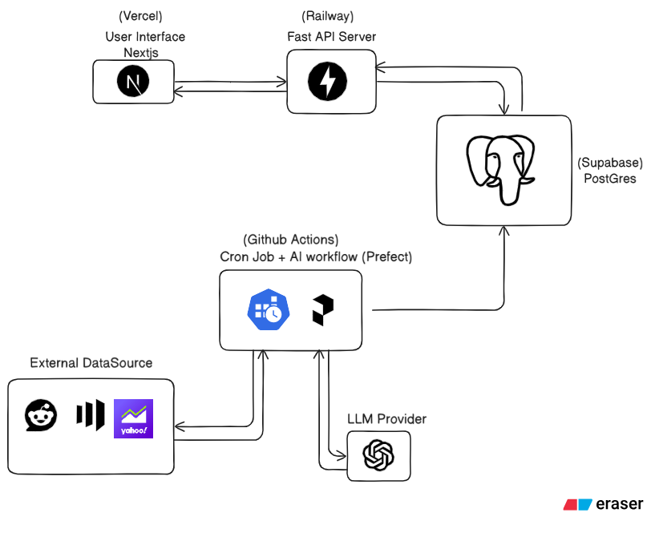

# Autonomous Investment Research

An autonomous investment research system that analyzes markets,
generates AI-driven investment decisions, executes paper trades, and
tracks portfolio performance through a structured decision engine.

The project explores whether LLM-powered agents can make disciplined,
risk-aware investment decisions in live market conditions.

------------------------------------------------------------------------

## Overview

This system operates as a fully automated investment pipeline:

1.  Ingest market data from the Nifty 50 universe\
2.  Identify high-potential stock candidates\
3.  Enrich candidates with recent financial news\
4.  Generate investment decisions using LLM reasoning\
5.  Execute paper trades with risk controls\
6.  Track portfolio performance and drawdowns over time

All steps are orchestrated via **Prefect**, providing observability,
retries, and execution history.

------------------------------------------------------------------------

## Architecture



**Core Components**

-   **FastAPI** --- Backend service exposing portfolio, decision, and
    trade APIs\
-   **PostgreSQL (Supabase)** --- Durable store for trades, decisions,
    and portfolio state\
-   **Prefect** --- Workflow orchestration for the investment engine\
-   **Next.js** --- Frontend dashboard for portfolio analytics\
-   **OpenAI / Ollama** --- Decision-generation models

------------------------------------------------------------------------

## Tech Stack

  Layer           Technology
  --------------- ---------------------------
  Backend         FastAPI, SQLAlchemy
  Frontend        Next.js (React)
  Database        PostgreSQL
  Orchestration   Prefect
  AI              OpenAI / Ollama
  Infra           Vercel, Railway, Supabase

------------------------------------------------------------------------

## Local Setup

### Backend

``` bash
cd backend
poetry install
poetry run python src/investment_engine/db/init_db.py
poetry run python scripts/seed.py
poetry run uvicorn investment_engine.main:app --reload
```

### Frontend

``` bash
cd frontend
npm install
npm run dev
```

------------------------------------------------------------------------

## Environment Variables

### Backend (`backend/.env`)

``` env
POSTGRES_URL=
OPENAI_API_KEY=
FRONTEND_ORIGIN=
MARKET_AUX_API_KEY=
MARKET_AUX_BASE_URL=
```

### Frontend (`frontend/.env.local`)

``` env
NEXT_PUBLIC_FASTAPI_URL=
NEXT_PUBLIC_API_URL=
```

------------------------------------------------------------------------

## Running the Investment Engine

Execute the daily workflow manually:

``` bash
cd backend
poetry run python scripts/run_engine.py
```

The flow:

-   Builds portfolio state\
-   Fetches market + news data\
-   Generates LLM decisions\
-   Executes paper trades\
-   Records portfolio snapshots

------------------------------------------------------------------------

## Deployment

The system is continuously deployed via Git-based workflows.

-   **Frontend:** Vercel\
-   **Backend:** Railway (Docker)\
-   **Database:** Supabase

Production deployments trigger automatically from the main branch.

**Live System**

Frontend:\
https://autonomous-investment-research-9yj7ixkbw.vercel.app/

------------------------------------------------------------------------

## Disclaimer

This project is for research and educational purposes only.\
No real trades are executed.
